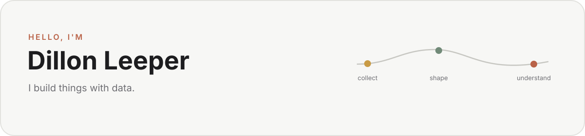

<picture>
  <source media="(prefers-color-scheme: dark)" srcset="assets/profile-banner-dark-minimal.svg">
  <source media="(prefers-color-scheme: light)" srcset="assets/profile-banner-light.svg">
  
</picture>

I work in ecommerce and spend a lot of my free time learning how to build better things with data.

I'm especially interested in data engineering and analytics engineering, but I'm still learning and building toward that direction.

Most of what you'll find here comes from either a real problem I wanted to solve, school, or something I thought would be fun to make.

## What I'm using lately

`Python` · `SQL` · `R` · `PostgreSQL` · `TypeScript` · `Next.js` · `Amazon SP-API` · `S3`

I'm also slowly building a 3D map of Manhattan buildings by construction year. There's not much there yet; I just think it would be cool to see the history of the city that way.

