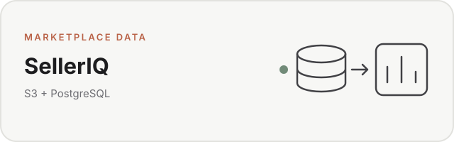
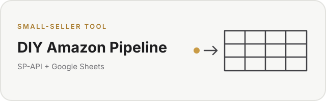
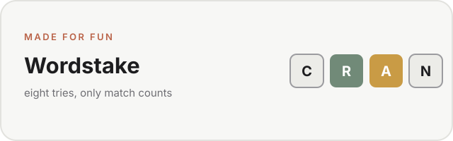

<picture>
  <source media="(prefers-color-scheme: dark)" srcset="assets/profile-banner-dark-minimal.svg">
  <source media="(prefers-color-scheme: light)" srcset="assets/profile-banner-light.svg">
  
</picture>

I work in ecommerce and spend a lot of my free time learning how to build better things with data.

I'm especially interested in data engineering and analytics engineering, but I'm still learning and building toward that direction.

Most of what you'll find here comes from either a real problem I wanted to solve, school, or something I thought would be fun to make.

## Things I've been building

<table>
  <tr>
    <td width="50%" valign="top">
      <a href="https://github.com/dillonleeper/SellerIQ">
        <picture>
          <source media="(prefers-color-scheme: dark)" srcset="assets/project-selleriq-dark.svg">
          <source media="(prefers-color-scheme: light)" srcset="assets/project-selleriq-light.svg">
          
        </picture>
      </a>
      
An ecommerce analytics project I'm building around problems I've dealt with at work: getting Amazon marketplace data out of different systems, organizing it, and being able to answer questions with it.

      
<code>Python</code> <code>PostgreSQL</code> <code>Amazon SP-API</code> <code>S3</code> <code>Next.js</code>

      
<a href="https://github.com/dillonleeper/SellerIQ">View SellerIQ</a>

    </td>
    <td width="50%" valign="top">
      <a href="https://github.com/dillonleeper/amazon-sp-api-sales-pipeline">
        <picture>
          <source media="(prefers-color-scheme: dark)" srcset="assets/project-amazon-pipeline-dark.svg">
          <source media="(prefers-color-scheme: light)" srcset="assets/project-amazon-pipeline-light.svg">
          
        </picture>
      </a>
      
One of my first Python projects: a bootstrapped reporting setup for small Amazon sellers who want their weekly sales and traffic data in Google Sheets without another analytics subscription.

      
<code>Python</code> <code>Amazon SP-API</code> <code>Google Sheets API</code>

      
<a href="https://github.com/dillonleeper/amazon-sp-api-sales-pipeline">View the DIY pipeline</a>

    </td>
  </tr>
  <tr>
    <td width="50%" valign="top">
      <a href="https://github.com/dillonleeper/DATA-607">
        <picture>
          <source media="(prefers-color-scheme: dark)" srcset="assets/project-data607-dark.svg">
          <source media="(prefers-color-scheme: light)" srcset="assets/project-data607-light.svg">
          
        </picture>
      </a>
      
My coursework for CUNY's Data Acquisition and Management class. This is where I'm working through SQL, PostgreSQL, R, data collection, and reproducible analysis.

      
<code>SQL</code> <code>PostgreSQL</code> <code>R</code> <code>Quarto</code>

      
<a href="https://github.com/dillonleeper/DATA-607">View DATA 607</a>

    </td>
    <td width="50%" valign="top">
      <a href="https://github.com/dillonleeper/wordstake">
        <picture>
          <source media="(prefers-color-scheme: dark)" srcset="assets/project-wordstake-dark.svg">
          <source media="(prefers-color-scheme: light)" srcset="assets/project-wordstake-light.svg">
          
        </picture>
      </a>
      
A daily word game I built because I wanted to make something that wasn't about ecommerce or dashboards. You get eight tries and match counts instead of letter positions.

      
<code>HTML</code> <code>CSS</code> <code>JavaScript</code> <code>Supabase</code>

      
<a href="https://github.com/dillonleeper/wordstake">View Wordstake</a> · <a href="https://word-stake.com/">Play the game</a>

    </td>
  </tr>
</table>

## What I'm using lately

`Python` · `SQL` · `R` · `PostgreSQL` · `TypeScript` · `Next.js` · `Amazon SP-API` · `S3`

I'm also slowly building a 3D map of Manhattan buildings by construction year. There's not much there yet, which is why it isn't featured above. I just think it would be cool to see the history of the city that way.

